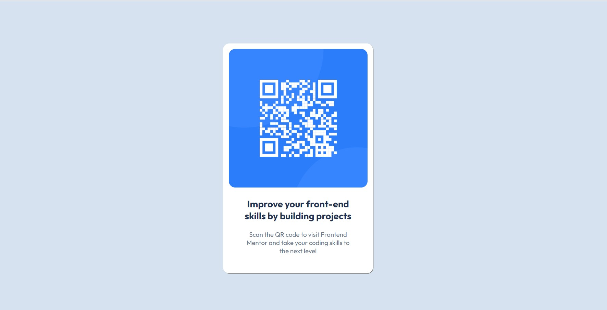

# Frontend Mentor - QR code component solution

This is a solution to the [QR code component challenge on Frontend Mentor](https://www.frontendmentor.io/challenges/qr-code-component-iux_sIO_H). Frontend Mentor challenges help you improve your coding skills by building realistic projects. 

## Table of contents

- [Overview](#overview)
  - [Screenshot](#screenshot)
  - [Links](#links)
- [My process](#my-process)
  - [Built with](#built-with)
  - [What I learned](#what-i-learned)
  - [Continued development](#continued-development)
- [Author](#author)

**Note: Delete this note and update the table of contents based on what sections you keep.**

## Overview
Project Design of QR Code Component using HTML and CSS.

### Screenshot



### Links

- Solution URL: [http://127.0.0.1:5500/index.html](https://your-solution-url.com)

## My process
First I write HTML code, like i created div element and put two elements (h1 and p) inside it. And then i write CSS for that HTML file to style that HTML file.
### Built with

- Semantic HTML5 markup
- CSS custom properties
- Flexbox
- Box-Model

### What I learned

I learned alot of things during this challenge but at the some part of code i face some difficulty to align the h1 element and p element....


below are code snippets on that part i faced difficulty

```html
<h1>Improve your front-end skills by building projects</h1>
      <p>Scan the QR code to visit Frontend Mentor and take your coding skills to the next level</p>
```
```css
h1{
  width:80%;
}
and

p{
  width:85%;
}
```


### Continued development
I want to continue focus on media quaries to make website responsive beacuase i haven't learn media quaries yet.

## Author

- Frontend Mentor - [@basitali07](https://www.frontendmentor.io/profile/basitali07)
